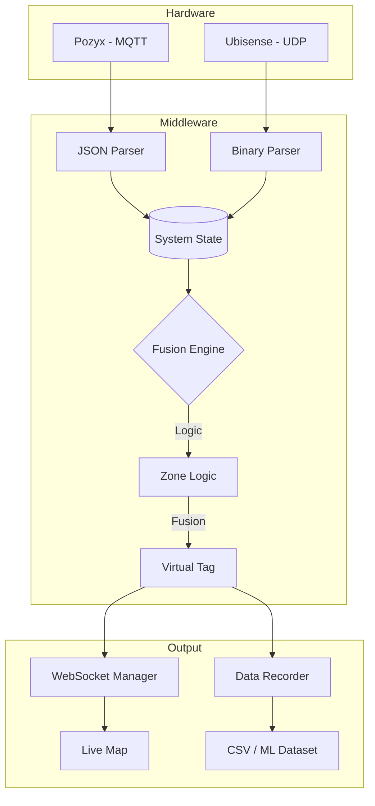
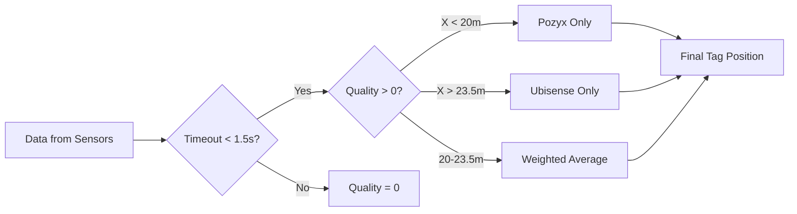
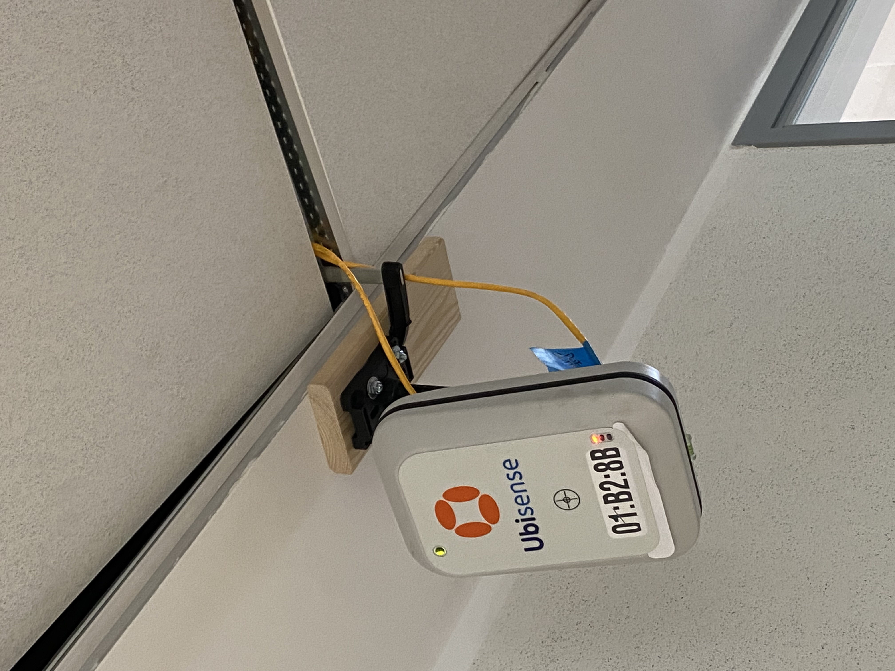
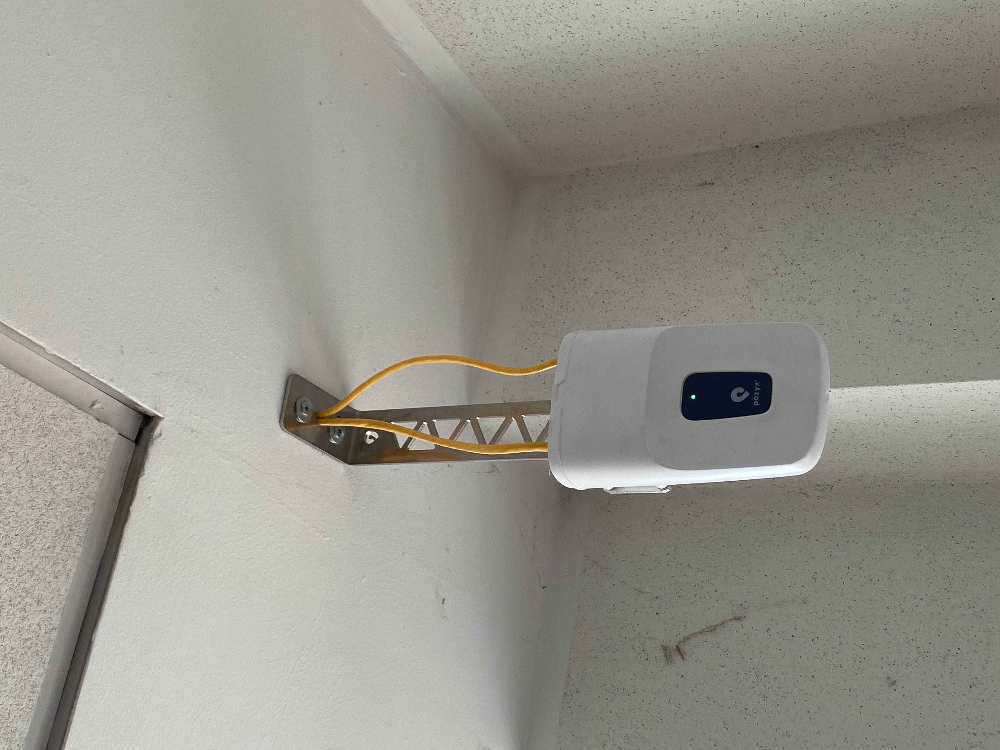
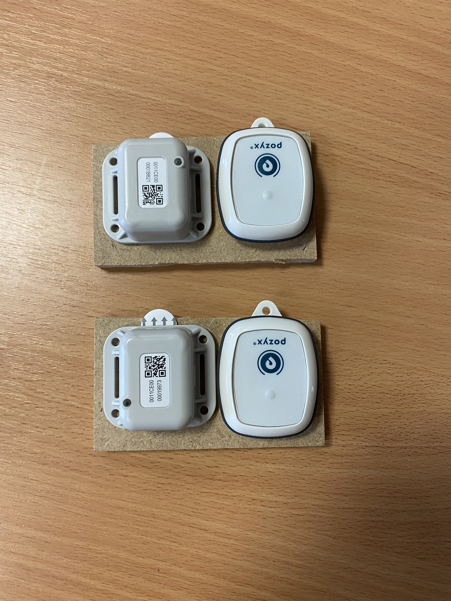
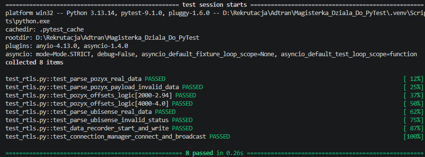
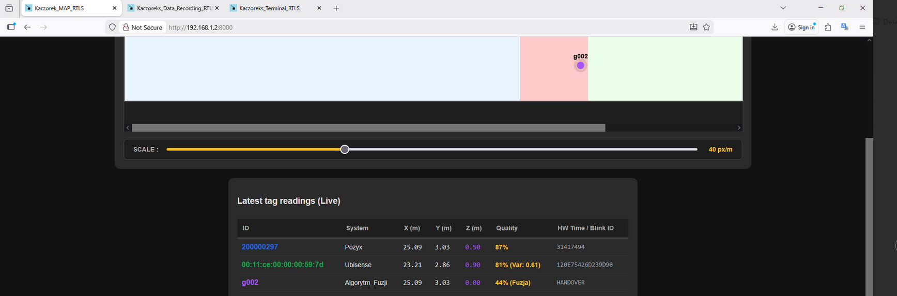

# RTLS Data Fusion Middleware (Master's Thesis)

This repository contains the testing suite and documentation for my Master's thesis project. The main goal was to build a backend server in FastAPI that takes real-time location data from two completely different UWB (Ultra-Wideband) systems—**Pozyx** (MQTT) and **Ubisense** (UDP)—and fuses them together into one unified map.


## System Architecture

Here is a quick look at how the data flows from the ceiling sensors to the web browser:



## Fusion Logic

The most important part of the code is deciding which system to trust at any given moment. I implemented a zone-based handover logic:



---

## Hardware Setup

Since this wasn't just a purely software project, I had to physically install, wire PoE, and calibrate all the hardware in the lab.
### 1. The Anchors
I used Ubisense and Pozyx. I even had to make a custom wooden mount for Ubisense to fit the ceiling grid properly.

<p align="center">
  
  
</p>

### 2. Ground-Truth Tags
To test if the fusion algorithm actually works, I mounted both tags to a rigid piece of wood. This way, they follow the exact same path, giving me a perfect baseline for testing the accuracy of the software.

<p align="center">
  
</p>

---

## 🖥️ Live Dashboard

Here is a screenshot of the system running. The table shows Pozyx and Ubisense readings, and the `g002` row is my algorithm calculating the fused position in real-time (showing a 'Handover' happening at 44% quality).


---

## 🧪 Testing with PyTest

To make sure I don't break the fusion math while tweaking the code, I wrote a test suite. It uses **real production data dumps** (saved hex and JSON logs from the network) instead of fake numbers.

```bash
# Running the tests locally
pytest -v

```

---

## Academic Plagiarism Note (JSA)

*Note for recruiters:* Because Polish universities use the JSA (Jednolity System Antyplagiatowy) to scan theses, I had to temporarily remove the core `.py` backend files from this public repo so I don't accidentally plagiarize my own work.

This public mirror includes the architecture, tests, and hardware setup. I am more than happy to share the private repo or do a full code walkthrough during an interview!

## Software Architecture & Dashboards

The project is split into a Python backend (FastAPI) and a vanilla HTML/JS frontend. I wanted a lightweight way to process the high-frequency UWB data and immediately stream it to the browser via WebSockets without heavy framework overhead.

### 1. Backend Core Files
* **`main.py`**: The FastAPI application entry point. It hosts the web server and manages the live WebSocket (`/ws`) broadcasts.
* **`fusion_engine.py`**: The brain of the operation. This contains the spatial logic and weighted average calculations for merging the physical Pozyx and Ubisense tags into a unified virtual tag (e.g., `g002`).
* **`receivers.py`**: Handles the asynchronous network traffic, unpacking MQTT JSON payloads for Pozyx and decoding binary UDP packets for Ubisense.
* **`recorder.py`**: A utility class that manages continuous CSV logging, ground-truth reference capturing, and isolated Machine Learning payload saving.
* **`config.py`**: Stores all the physical offset calibrations, IP addresses, network ports, and static thresholds.

### 2. Live Web Interfaces
The frontend consists of several dashboards to monitor the raw hardware streams and visualize the fused algorithm output in real-time.

* **`index.html`**: The main corridor map. It visualizes the physical tracking zones and plots the coordinates of the tags alongside a live metrics table.
* **`terminals.html`**: A dual-pane raw data monitor to verify that the backend is actively receiving and parsing the UDP and MQTT packets.

<p align="center">
  
  <br><br>
  
</p>

* **`zapis.html` & `mobile.html`**: Dedicated data recording panels for desktop and mobile. I used the mobile version on my phone while physically walking the hall to log ground-truth reference coordinates at specific floor markers.
* **`mobile_map.html`**: A vertically oriented tracking map designed specifically for phone screens.
